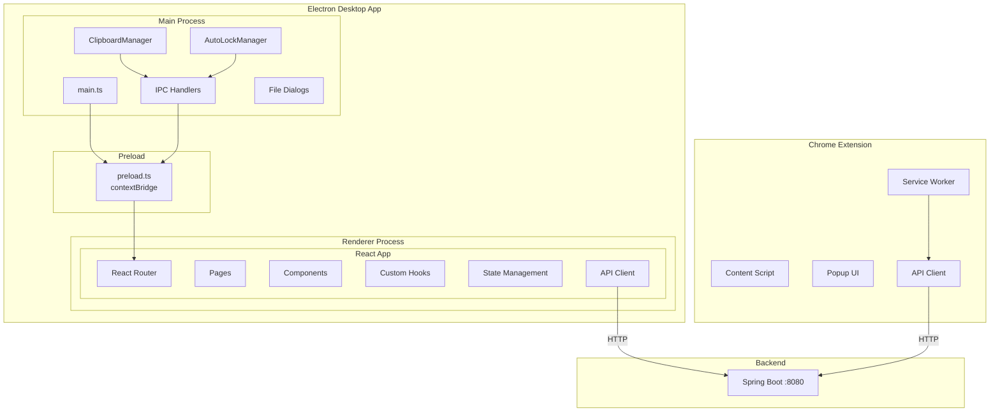

# 技术设计文档：密码管理器前端

## 概述

本设计文档描述密码管理器前端的技术架构与实现方案，涵盖 Electron 桌面应用和 Chrome 浏览器扩展两个客户端。前端基于已完成的 Spring Boot 后端 REST API 构建，采用 Electron + React + TypeScript + Vite 技术栈。

### 核心设计目标

- **安全优先**：通过 Electron 进程隔离、Preload 安全桥接、剪贴板定时清除、自动锁定等机制保障密码数据安全
- **响应式交互**：提供流畅的 UI 体验，包括实时搜索、密码强度可视化、30 秒自动掩码等
- **模块化架构**：清晰的组件分层和状态管理，便于维护和扩展
- **与后端对齐**：TypeScript 接口严格映射后端 DTO，统一的 API 客户端封装

## 架构

### 整体架构



### Electron 三层架构

| 层级 | 职责 | 技术 |
|------|------|------|
| Main Process | 窗口管理、剪贴板操作、自动锁定检测、文件对话框、系统托盘 | Electron Main API |
| Preload Script | 安全桥接，通过 `contextBridge` 暴露有限 IPC 接口 | electron contextBridge |
| Renderer Process | React UI 渲染、路由管理、状态管理、API 调用 | React + TypeScript + Vite |

### 页面路由设计

```mermaid
graph LR
    Start([启动]) --> Check{后端是否<br/>已设置密码?}
    Check -->|否| Setup[/setup<br/>SetupPage]
    Check -->|是| Unlock[/unlock<br/>UnlockPage]
    Setup --> Unlock
    Unlock -->|MFA| MFA[TOTP 验证]
    MFA --> Vault
    Unlock -->|成功| Vault[/vault<br/>VaultPage]
    Vault --> Detail[/vault/:id<br/>CredentialDetailPage]
    Vault --> Create[/vault/new<br/>CreateCredentialPage]
    Detail --> History[密码历史<br/>内嵌面板]
    
    Vault -.-> Gen[/generator<br/>PasswordGeneratorPage]
    Vault -.-> Report[/security-report<br/>SecurityReportPage]
    Vault -.-> IE[/import-export<br/>ImportExportPage]
    Vault -.-> Settings[/settings<br/>SettingsPage]
```

路由守卫逻辑：
- 未解锁状态：所有路由重定向到 `/unlock`（或 `/setup`）
- 已解锁状态：可访问所有功能页面
- Session 过期（401）：自动跳转到 `/unlock`

## 组件与接口

### React 组件树

```
App
├── AppLayout（侧边栏 + 内容区）
│   ├── Sidebar（导航菜单）
│   └── <Outlet/>（路由内容）
│       ├── VaultPage
│       │   ├── SearchBar
│       │   ├── TagFilter
│       │   └── CredentialCard[]
│       ├── CredentialDetailPage
│       │   ├── PasswordField（掩码/明文 + 倒计时）
│       │   ├── PasswordHistoryPanel
│       │   └── ConfirmDialog
│       ├── CreateCredentialPage
│       │   └── CredentialForm
│       ├── PasswordGeneratorPage
│       │   ├── RuleConfigPanel
│       │   └── StrengthIndicator
│       ├── SecurityReportPage
│       │   ├── StatsCards
│       │   └── ReportTabList
│       ├── ImportExportPage
│       │   ├── ExportSection
│       │   └── ImportSection
│       └── SettingsPage
│           ├── AutoLockConfig
│           └── MfaManagement
├── SetupPage
├── UnlockPage
│   └── PasswordInput（掩码/明文切换）
└── LoadingSpinner
```

### 核心组件接口

```typescript
// PasswordInput - 密码输入组件（掩码/明文切换）
interface PasswordInputProps {
  value: string;
  onChange: (value: string) => void;
  placeholder?: string;
  error?: string;
}

// CredentialCard - 凭证卡片
interface CredentialCardProps {
  credential: CredentialListItem;
  onClick: (id: number) => void;
}

// SearchBar - 搜索栏
interface SearchBarProps {
  onSearch: (keyword: string) => void;
  placeholder?: string;
}

// TagFilter - 标签筛选
interface TagFilterProps {
  tags: string[];
  selectedTag: string | null;
  onSelect: (tag: string | null) => void;
}

// StrengthIndicator - 密码强度指示器
interface StrengthIndicatorProps {
  level: PasswordStrengthLevel;
}

// ConfirmDialog - 确认对话框
interface ConfirmDialogProps {
  open: boolean;
  title: string;
  message: string;
  onConfirm: () => void;
  onCancel: () => void;
}

// PasswordField - 密码显示字段（带掩码/明文切换和倒计时）
interface PasswordFieldProps {
  credentialId: number;
  maskedPassword: string;
}
```

### API Client 接口

```typescript
// API 客户端核心接口
interface ApiClient {
  // Auth
  setup(masterPassword: string): Promise<void>;
  unlock(masterPassword: string): Promise<UnlockResult>;
  verifyTotp(totpCode: string): Promise<UnlockResult>;
  lock(): Promise<void>;
  enableMfa(totpCode?: string): Promise<MfaSetupResult>;
  disableMfa(): Promise<void>;

  // Credentials
  listCredentials(tag?: string): Promise<CredentialListItem[]>;
  searchCredentials(keyword: string): Promise<CredentialListItem[]>;
  getCredential(id: number): Promise<Credential>;
  revealPassword(id: number): Promise<string>;
  createCredential(data: CreateCredentialData): Promise<Credential>;
  updateCredential(id: number, data: UpdateCredentialData): Promise<Credential>;
  deleteCredential(id: number): Promise<void>;

  // Password Generator
  generatePassword(options: GeneratePasswordOptions): Promise<GeneratedPassword>;
  evaluateStrength(password: string): Promise<PasswordStrengthLevel>;
  getRules(): Promise<PasswordRule[]>;
  saveRule(rule: SaveRuleData): Promise<PasswordRule>;
  deleteRule(id: number): Promise<void>;

  // Password History
  getPasswordHistory(credentialId: number): Promise<PasswordHistoryItem[]>;
  revealHistoryPassword(credentialId: number, historyId: number): Promise<string>;

  // Security Report
  getSecurityReport(): Promise<SecurityReport>;
  getWeakPasswords(): Promise<CredentialListItem[]>;
  getDuplicatePasswords(): Promise<CredentialListItem[]>;
  getExpiredPasswords(): Promise<CredentialListItem[]>;

  // Import/Export
  exportData(encryptionPassword: string): Promise<Blob>;
  importData(file: File, filePassword: string, conflictStrategy: ConflictStrategy): Promise<ImportResult>;

  // Settings
  getSettings(): Promise<Settings>;
  updateSettings(autoLockMinutes: number): Promise<void>;
}
```

### Preload Bridge 接口（IPC）

```typescript
// 暴露给 Renderer Process 的安全接口
interface ElectronBridge {
  clipboard: {
    copyPassword(password: string): Promise<void>;  // 复制密码到剪贴板，60秒后自动清除
  };
  autoLock: {
    onLockTriggered(callback: () => void): void;     // 监听自动锁定事件
    reportActivity(): void;                           // 报告用户活动（重置计时器）
  };
  dialog: {
    showSaveDialog(defaultName: string): Promise<string | null>;  // 文件保存对话框
    showOpenDialog(filters: FileFilter[]): Promise<string | null>; // 文件选择对话框
  };
}
```

### 状态管理

采用 React Context + useReducer 进行轻量级状态管理：

```typescript
// 全局认证状态
interface AuthState {
  isUnlocked: boolean;
  sessionToken: string | null;
  mfaRequired: boolean;
}

// 认证 Context Actions
type AuthAction =
  | { type: 'UNLOCK_SUCCESS'; sessionToken: string }
  | { type: 'MFA_REQUIRED' }
  | { type: 'LOCK' };
```

不使用 Redux 等重量级状态管理库，原因：
- 应用状态较简单，主要是认证状态和页面级数据
- 页面数据通过 API 调用获取，不需要全局缓存
- React Context + Hooks 足以满足需求


## 数据模型

### TypeScript 接口定义（映射后端 DTO）

#### 通用响应

```typescript
// 统一 API 响应格式
interface ApiResponse<T> {
  code: number;
  message: string;
  data: T;
}
```

#### 认证相关

```typescript
interface UnlockResult {
  mfaRequired: boolean;
  sessionToken: string | null;
}

interface MfaSetupResult {
  qrCodeUri: string;
  recoveryCodes: string[];
}
```

#### 凭证相关

```typescript
// 凭证列表摘要（对应 CredentialListResponse）
interface CredentialListItem {
  id: number;
  accountName: string;
  username: string;
  url: string;
  tags: string;
}

// 凭证详情（对应 CredentialResponse）
interface Credential {
  id: number;
  accountName: string;
  username: string;
  maskedPassword: string;
  url: string;
  notes: string;
  tags: string;
  createdAt: string;   // ISO 8601
  updatedAt: string;   // ISO 8601
}

// 创建凭证请求（对应 CreateCredentialRequest）
interface CreateCredentialData {
  accountName: string;
  username: string;
  password?: string;
  url?: string;
  notes?: string;
  tags?: string;
  autoGenerate?: boolean;
}

// 更新凭证请求（对应 UpdateCredentialRequest）
interface UpdateCredentialData {
  accountName?: string;
  username?: string;
  password?: string;
  url?: string;
  notes?: string;
  tags?: string;
}
```

#### 密码生成器相关

```typescript
// 密码强度等级（对应 PasswordStrengthLevel 枚举）
type PasswordStrengthLevel = 'WEAK' | 'MEDIUM' | 'STRONG';

// 生成密码选项（对应 GeneratePasswordRequest）
interface GeneratePasswordOptions {
  length?: number;
  includeUppercase?: boolean;
  includeLowercase?: boolean;
  includeDigits?: boolean;
  includeSpecial?: boolean;
  useDefault?: boolean;
}

// 生成密码结果（对应 GeneratedPasswordResponse）
interface GeneratedPassword {
  password: string;
  strengthLevel: PasswordStrengthLevel;
}

// 密码规则（对应 PasswordRuleResponse）
interface PasswordRule {
  id: number;
  ruleName: string;
  length: number;
  includeUppercase: boolean;
  includeLowercase: boolean;
  includeDigits: boolean;
  includeSpecial: boolean;
  isDefault: boolean;
  createdAt: string;
  updatedAt: string;
}
```

#### 密码历史相关

```typescript
// 密码历史记录（对应 PasswordHistoryResponse）
interface PasswordHistoryItem {
  id: number;
  maskedPassword: string;
  changedAt: string;  // ISO 8601
}
```

#### 安全报告相关

```typescript
// 安全报告统计（对应 SecurityReportResponse）
interface SecurityReport {
  totalCredentials: number;
  weakPasswordCount: number;
  duplicatePasswordCount: number;
  expiredPasswordCount: number;
}
```

#### 导入导出相关

```typescript
// 冲突策略（对应 ConflictStrategy 枚举）
type ConflictStrategy = 'OVERWRITE' | 'SKIP' | 'KEEP_BOTH';

// 导入结果（对应 ImportResultResponse）
interface ImportResult {
  importedCount: number;
  skippedCount: number;
  overwrittenCount: number;
  totalCount: number;
}
```

#### 设置相关

```typescript
// 设置（对应 SettingsResponse）
interface Settings {
  autoLockMinutes: number;
}
```

### Chrome Extension 数据模型

```typescript
// 扩展内部消息类型
type ExtensionMessage =
  | { type: 'SEARCH_CREDENTIALS'; keyword: string }
  | { type: 'AUTO_FILL'; credentialId: number }
  | { type: 'CHECK_VAULT_STATUS' }
  | { type: 'LOGIN_FORM_DETECTED'; url: string };

// 自动填充数据
interface AutoFillData {
  username: string;
  password: string;
}

// 登录表单检测结果
interface LoginFormInfo {
  url: string;
  usernameField: HTMLInputElement | null;
  passwordField: HTMLInputElement;
}
```


## 正确性属性

*正确性属性是在系统所有有效执行中都应成立的特征或行为——本质上是关于系统应该做什么的形式化陈述。属性是人类可读规范与机器可验证正确性保证之间的桥梁。*

### Property 1: API 客户端响应解析正确性

*对于任意* API 响应，当 `code` 为 0 时，API 客户端应正确提取 `data` 字段并返回；当 `code` 不为 0 时，API 客户端应抛出包含 `message` 信息的错误。

**Validates: Requirements 1.5, 1.6**

### Property 2: 请求携带 Session Token

*对于任意*已解锁状态下发出的 API 请求，请求头中应包含有效的 Session_Token；未解锁状态下不应携带 Token。

**Validates: Requirements 1.7**

### Property 3: 密码确认不一致验证

*对于任意*两个不相同的字符串作为密码和确认密码输入，SetupPage 的表单验证应返回失败并提示"两次输入的密码不一致"；当两个字符串相同时，该验证应通过。

**Validates: Requirements 2.3**

### Property 4: PasswordInput 掩码/明文切换

*对于任意*密码字符串，PasswordInput 组件在掩码模式下应显示掩码字符（不包含原始密码字符），切换到明文模式后应显示原始密码字符串，再次切换应恢复掩码显示。

**Validates: Requirements 2.10**

### Property 5: 错误响应统一展示

*对于任意*后端返回的错误响应（code ≠ 0）或网络错误，应用应在 UI 中展示对应的错误提示信息，且错误信息应包含后端返回的 message 内容或网络错误描述。

**Validates: Requirements 2.9, 3.8, 5.6, 9.8, 14.4**

### Property 6: 搜索关键词触发 API 调用

*对于任意*非空搜索关键词，在 SearchBar 中输入后应触发搜索 API 调用，且搜索结果列表应更新为 API 返回的数据。

**Validates: Requirements 3.3**

### Property 7: 标签筛选结果正确性

*对于任意*标签选择，VaultPage 展示的凭证列表应仅包含带有该标签的凭证；选择"全部"时应展示所有凭证。

**Validates: Requirements 3.5**

### Property 8: 密码 30 秒自动掩码

*对于任意*凭证密码或历史密码，在用户点击"显示密码"后，密码应以明文展示，且在 30 秒后自动恢复为掩码显示。

**Validates: Requirements 4.3, 7.3**

### Property 9: 剪贴板 60 秒自动清除

*对于任意*密码复制操作，Clipboard_Manager 应将密码写入系统剪贴板，并在 60 秒后自动清除剪贴板内容。当新的复制请求到达时，应取消上一次倒计时并重新开始 60 秒计时。

**Validates: Requirements 4.4, 7.4, 11.2, 11.3, 11.4**

### Property 10: 凭证创建必填字段验证

*对于任意*必填字段（账户名称、用户名、密码）的组合，当任一必填字段为空时，表单提交应被阻止并在对应字段下方显示验证错误提示；当所有必填字段非空时，验证应通过。

**Validates: Requirements 5.4**

### Property 11: 密码强度指示器映射

*对于任意*密码强度等级（WEAK/MEDIUM/STRONG），StrengthIndicator 组件应分别显示对应的颜色（红色/黄色/绿色）和文字标签。

**Validates: Requirements 6.4**

### Property 12: 已保存规则选择自动填充

*对于任意*已保存的密码规则，当用户选择该规则时，PasswordGeneratorPage 的配置表单应自动填充该规则的所有参数（长度、大写、小写、数字、特殊字符）。

**Validates: Requirements 6.8**

### Property 13: 密码历史排序与完整性

*对于任意*密码历史记录列表，记录应按变更时间降序排列，且每条记录应包含掩码密码和变更时间两个字段。

**Validates: Requirements 7.1, 7.2**

### Property 14: 导入结果摘要完整性

*对于任意*导入操作结果，摘要应展示成功数量、跳过数量和总数量，且各数量之和应与总数量一致。

**Validates: Requirements 9.7**

### Property 15: 自动锁定超时范围验证

*对于任意*自动锁定超时输入值，1-60 分钟范围内的值应被接受，超出范围的值应被拒绝。

**Validates: Requirements 10.2**

### Property 16: 锁定状态路由守卫

*对于任意*路由路径，当 Vault 处于锁定状态（包括 Session_Token 无效或过期返回 401）时，应用应重定向到 UnlockPage，禁止访问其他功能页面。

**Validates: Requirements 12.3, 14.3**

### Property 17: 锁定后状态清除

*对于任意*锁定事件（手动锁定或自动锁定超时），Renderer_Process 应清除内存中的 Session_Token 和所有已解密的凭证数据，并导航到 UnlockPage。

**Validates: Requirements 11.5, 11.6**

### Property 18: 登录表单检测

*对于任意*包含 `input[type="password"]` 元素的网页，Content_Script 应检测到登录表单并提取页面 URL；对于不包含密码输入框的页面，不应触发检测。

**Validates: Requirements 13.4**

### Property 19: 自动填充凭证正确性

*对于任意*匹配的凭证和登录表单，当用户选择该凭证进行自动填充时，表单的用户名字段应填入凭证的 username，密码字段应填入凭证的 password。

**Validates: Requirements 13.3, 13.5, 13.6**

## 错误处理

### 错误分类与处理策略

| 错误类型 | 触发条件 | 处理方式 |
|---------|---------|---------|
| API 业务错误 | 后端返回 `code ≠ 0` | 提取 `message` 字段，在页面对应位置显示错误提示 |
| 网络错误 | 请求超时、连接失败 | 显示"网络连接失败，请检查后端服务是否启动"提示 + 重试按钮 |
| 认证过期 | 后端返回 HTTP 401 | 清除 Session_Token，自动跳转到 UnlockPage |
| 表单验证错误 | 必填字段为空、密码不一致等 | 在对应字段下方显示红色错误提示文字 |
| 文件操作错误 | 导入文件格式错误、密码错误 | 在导入区域显示具体错误信息 |

### API Client 错误处理流程

```typescript
// API Client 统一错误处理
async function request<T>(url: string, options: RequestInit): Promise<T> {
  try {
    const response = await fetch(url, options);
    
    if (response.status === 401) {
      // 认证过期，触发锁定
      authContext.dispatch({ type: 'LOCK' });
      throw new AuthExpiredError('会话已过期，请重新解锁');
    }
    
    const result: ApiResponse<T> = await response.json();
    
    if (result.code !== 0) {
      throw new ApiError(result.code, result.message);
    }
    
    return result.data;
  } catch (error) {
    if (error instanceof TypeError) {
      throw new NetworkError('网络连接失败，请检查后端服务是否启动');
    }
    throw error;
  }
}
```

### 自定义错误类型

```typescript
class ApiError extends Error {
  constructor(public code: number, message: string) {
    super(message);
    this.name = 'ApiError';
  }
}

class NetworkError extends Error {
  constructor(message: string) {
    super(message);
    this.name = 'NetworkError';
  }
}

class AuthExpiredError extends Error {
  constructor(message: string) {
    super(message);
    this.name = 'AuthExpiredError';
  }
}
```

## 测试策略

### 测试框架选择

| 测试类型 | 框架 | 用途 |
|---------|------|------|
| 单元测试 | Vitest | 组件逻辑、工具函数、API Client |
| 组件测试 | Vitest + React Testing Library | React 组件渲染和交互 |
| 属性测试 | fast-check (配合 Vitest) | 正确性属性验证 |
| E2E 测试 | Playwright (可选) | 端到端流程验证 |

### 属性测试配置

- 使用 `fast-check` 库进行属性测试
- 每个属性测试最少运行 100 次迭代
- 每个测试用注释标注对应的设计文档属性编号
- 标注格式：`// Feature: password-manager-frontend, Property {number}: {property_text}`

### 单元测试覆盖范围

单元测试聚焦于以下场景：
- **具体示例**：SetupPage 首次加载行为、UnlockPage MFA 流程、VaultPage 数据加载
- **边界条件**：空密码历史列表显示提示、搜索空关键词处理
- **集成点**：IPC 通信模拟、API Client 与 Mock Server 交互
- **错误场景**：网络断开、后端返回各类错误码

### 属性测试覆盖范围

属性测试覆盖设计文档中定义的 19 个正确性属性，每个属性对应一个属性测试：

- Property 1: API 响应解析 → 生成随机 `{code, message, data}` 对象验证解析逻辑
- Property 2: Session Token 携带 → 生成随机 token 验证请求头构造
- Property 3: 密码确认验证 → 生成随机字符串对验证匹配逻辑
- Property 4: 掩码/明文切换 → 生成随机密码验证显示状态切换
- Property 5: 错误展示 → 生成随机错误响应验证 UI 展示
- Property 6: 搜索触发 → 生成随机关键词验证 API 调用
- Property 7: 标签筛选 → 生成随机凭证列表和标签验证筛选结果
- Property 8: 30 秒自动掩码 → 生成随机密码验证定时器行为
- Property 9: 60 秒剪贴板清除 → 生成随机密码验证剪贴板管理
- Property 10: 必填字段验证 → 生成随机表单数据验证验证逻辑
- Property 11: 强度指示器映射 → 生成随机强度等级验证颜色/文字映射
- Property 12: 规则自动填充 → 生成随机规则验证表单填充
- Property 13: 历史排序 → 生成随机历史记录验证排序
- Property 14: 导入结果摘要 → 生成随机导入结果验证数量一致性
- Property 15: 超时范围验证 → 生成随机数值验证范围检查
- Property 16: 路由守卫 → 生成随机路由路径验证重定向
- Property 17: 锁定状态清除 → 验证锁定后状态清空
- Property 18: 登录表单检测 → 生成随机 HTML 片段验证检测逻辑
- Property 19: 自动填充正确性 → 生成随机凭证和表单验证填充

每个属性测试必须由单个属性测试实现，标注格式示例：

```typescript
// Feature: password-manager-frontend, Property 1: API 客户端响应解析正确性
it.prop('should correctly parse API responses', [apiResponseArb], (response) => {
  // ...
});
```
